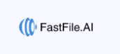
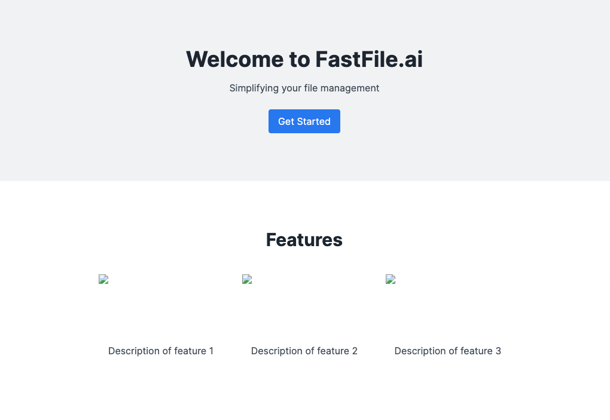

# fastfile-demo-proposal

## Proposal Details / Potential Solutions
### My Approach / Outline: 
To address the main concern, I am taking a systematic approach involving several steps including strucuring the project carefully, content inventory etc. 
We need to identify and document ALL content elements(Text, images, links etc.) and create a structured format.
We also need to ensure our project structure is extremely clean and organized.
And we need to organize content in a centralized format which is top priority.

#### Outline of Steps to Execution: 
1. Analyze the Current Website (Components) [X]
2. Set Up Next.js Project with TailwindCSS [X]
3. Create Project Structure [/]
4. Create and Configure Components [/]
5. Organize Content in /data Directory
6. Update Pages
7. Deployment with AWS Amplify

### Availability / Timeframe confirmation: 
No issues.
### Examples of similar projects: 
I think this repo setup and initial project start should satisfy that inquiry.
But recently I was involved with a Cloud migration from PCF to Azure so I'm experience in Migrations at the Enterprise level and have 10+ years of Front-End Experience. 

### Developer Notes:
I've already started with the Project structure and Setup as well as the Component Development which are key parts of this effort. I look forward to working together in business in bringing you the desired solution and completing this effort.

